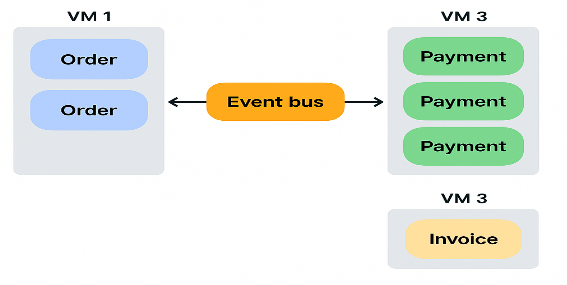
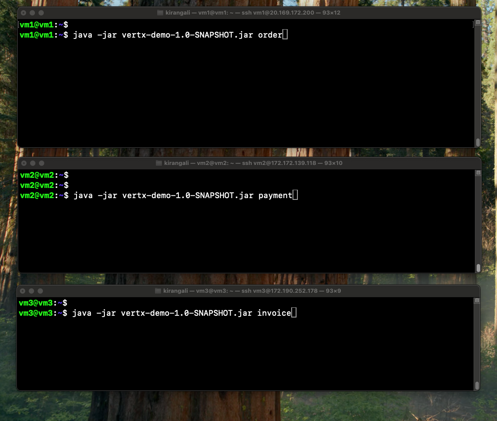
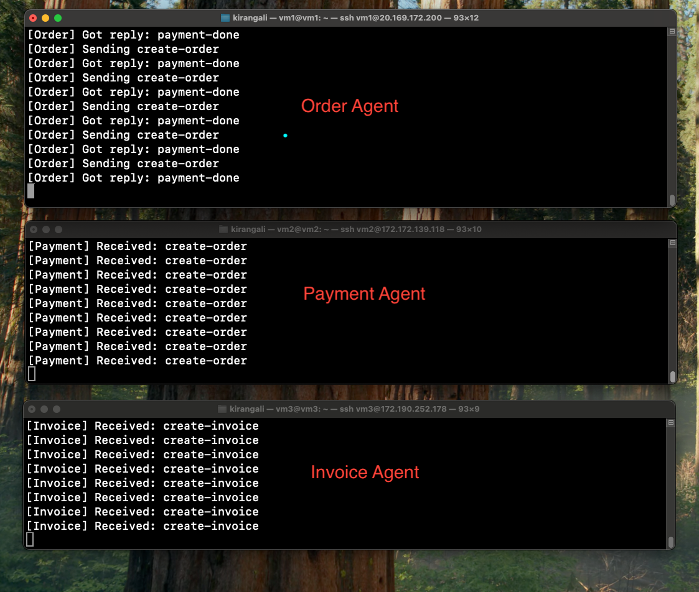
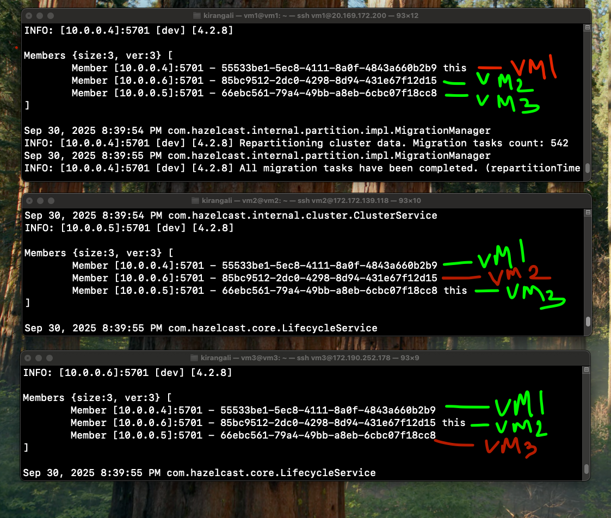
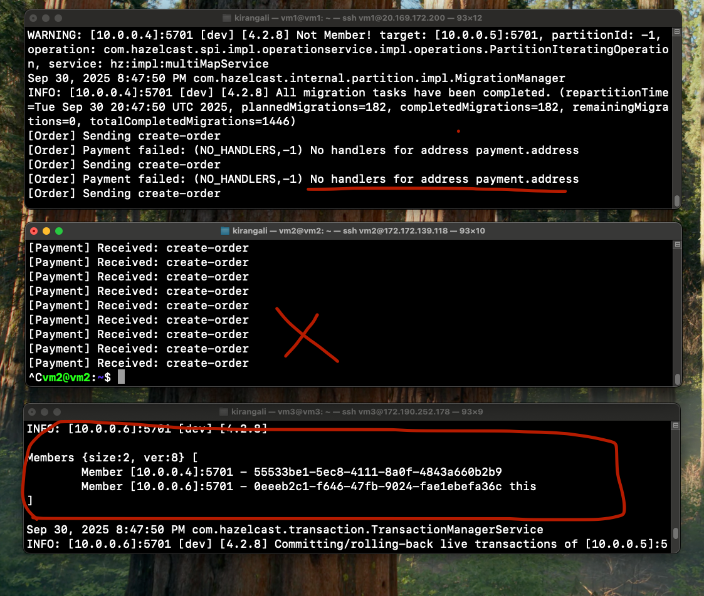

> **Note:** This document was written by hand, not generated by AI.  

# A Distributed, Highly Scalable Framework for Agentic AI Systems

## Problem

AI agents talk too much. They’re chatty.  
They fire off events. They ask each other for data, they send results, they try again when something fails.  

The more we try to wire them together with REST APIs, the more tangled they become. Scaling becomes harder.  
Agents deployed this way have no real awareness of each other. One keeps calling even when the other is still busy. They’re not reactive to others' issues.  

Most AI agents today still live in the same process, calling methods on each other.  
At best, people wire up multiple standalone processes with REST APIs.  

**Now the big questions are:**
- How do we build AI agents that can sit across the network and regions, ready to be scaled to any limit?  
- How do we build agents that can discover each other and exchange information remotely without REST APIs?  
- How do we build agents that don't require any warm up time, yet are still efficient and cost effective?  

---

## Solution

What agents need is a **nervous system**.  

What comes to mind is good old **CORBA** and **RMI**. These used to be popular in the old days. Yes, agents are not a new idea. *Déjà vu!*  

For this below implementation, we use a modern, lightweight, resource-efficient, and highly scalable alternative:  
**[Vert.x](https://vertx.io/)** a framework that comes with an internal messaging platform.  

We deployed **3 virtual machines in Azure**, intentionally **placed in different regions.**  

- **Hazelcast cluster configuration** was used to connect these VMs together.  
- All virtual machines communicate over a **private network** for safety.  

🔗 [Cluster.xml configuration](https://github.com/Kiran-G1/SwarmX/blob/main/cluster.xml)  

---

## Architecture

Here’s the high-level architecture of the system:

---

## Happy Path Case

1. **Cluster Ready**  
   3 VMs initialized and ready to take the shots.  

   

2. **Agents Triggered**  
   Agents register on the event bus, ready for action.  

   

3. **Discovery**  
   Agents discover each other automatically across network ports.  

   

4. **Communication**  
   Order agent sends events to Payment, which forwards to Invoice.  

5. **Resilience**  
   When the **Payment agent** was killed, the **Order agent** immediately knew nobody was listening to its events.  
   The **Invoice agent** also noticed the cluster change as one node detached.  
   No blind retries. No silent failures.  

   

---

## Summary

With Vert.x + Hazelcast, we can build:  
- Distributed AI agents across regions  
- Reactive and fault-tolerant communication  
- Scalable systems without REST API spaghetti  
